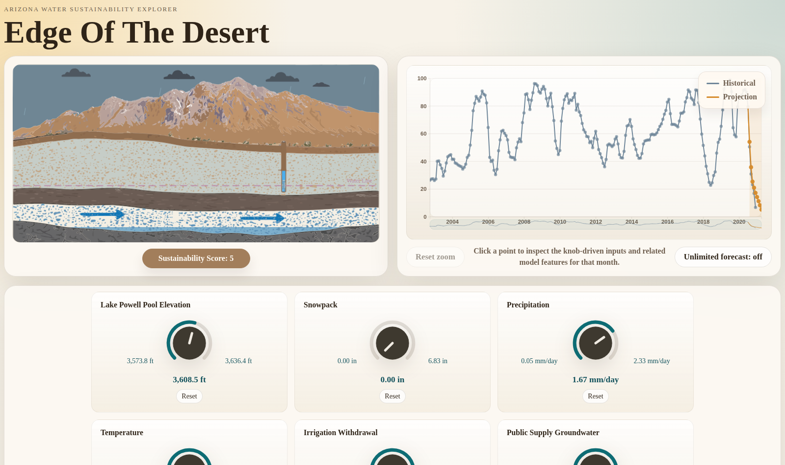

# Edge of the Desert

An interactive explorer for Arizona's water future. Turn knobs for snowpack, precipitation, temperature, Lake Powell's level and human water demand, and a model trained on 20+ years of satellite, hydrological and usage data predicts how sustainable the state's water supply would be. Everything runs in the browser: the trained XGBoost model is exported to ONNX and evaluated live with `onnxruntime-web`, with no backend.



## What you see

- **Aquifer cross-section.** An animated SVG of the ground beneath the desert. The water line, snow, irrigation pipe and sky respond to the knob values, and the sustainability score (0–100) sits beneath it.
- **Historical time series.** The real monthly score from the early 2000s onward, with the model's projection for your scenario drawn in orange. Click any month to inspect the inputs and model features behind it.
- **Control knobs.** Lake Powell pool elevation, snowpack, precipitation, temperature, irrigation withdrawal and public-supply groundwater, each bounded by its historical range.
- **Sound.** A Tone.js drone shifts with the score band, so the projection can be heard as well as seen.

## Running it

```bash
cd frontend
npm install
npm run dev        # http://localhost:8000
```

The trained model and the assets it needs are already in `frontend/public/model/`.

To rebuild the dataset and model from source (needs a NASA Earthdata token in `EARTHDATA_TOKEN`):

```bash
pip install -r requirements.txt
python scripts/phase1.py                 # download and join sources (config: config/phase1.example.json)
python scripts/phase2.py                 # train, cross-validate, export to ONNX
python scripts/phase3_prepare_assets.py  # copy the model and stats into the frontend
```

## Data Sources

| Feature | Source | Raw Resolution | Model Resolution |
|---|---|---|---|
| NDVI | MODIS MOD13A3 | Monthly | Monthly |
| 2m Temperature | MERRA-2 | Daily | Monthly avg |
| Specific Humidity | MERRA-2 | Daily | Monthly avg |
| Precipitation | MERRA-2 | Daily | Monthly avg |
| Snow Water Equivalent | Arizona SNOTEL bundle (NRCS / WRCC) -> `snotel_swe.csv` | Daily | Monthly endpoint |
| Streamflow | USGS NWIS -> `usgs_streamflow.csv` | Daily | Monthly endpoint |
| GRACE Groundwater Anomaly | NASA GRACE | Monthly | Monthly |
| GRACE/GRACE-FO Derived Recharge Estimate | NASA GRACE / GRACE-FO | Monthly | Monthly |
| Lake Powell Operations | Manual Powell bundle -> `powell_combined.csv` | Daily / irregular | Monthly endpoint |
| Irrigation Total Withdrawal | USGS Arizona HUC12 source -> `irrigation_huc12_monthly_az_2000_2020.csv` | Monthly | Monthly statewide endpoint |
| Public-Supply Total | NWAA Arizona HUC12 source -> `nwaa_public_supply_az_monthly.csv` | Monthly | Monthly statewide endpoint |
| Population | Arizona `AZPOP` observations -> `azpop_monthly.csv` | Annual | Monthly endpoint via interpolation |
| Inverted USDM Score | USDM -> `usdm_sustainability.csv` | Weekly | Monthly endpoint (target) |

Project target range: 2000-2023. Join key: `year_month`. The endpoint/source CSVs we were looking for now live in `data/Final`: `modis_ndvi.csv`, `usgs_streamflow.csv`, `usdm_sustainability.csv`, `snotel_swe.csv`, `irrigation_huc12_monthly_az_2000_2020.csv`, `nwaa_public_supply_az_monthly.csv`, `powell_combined.csv`, and `azpop_monthly.csv`. Coverage is still shorter for some sources: `snotel_swe.csv` spans `2000-10` through `2018-07`, and `irrigation_huc12_monthly_az_2000_2020.csv`, `nwaa_public_supply_az_monthly.csv`, `powell_combined.csv`, and `azpop_monthly.csv` span `2000-01` through `2020-12`, while `modis_ndvi.csv`, `usgs_streamflow.csv`, and `usdm_sustainability.csv` extend through `2023-12`. Earlier filenames such as `snotel_swe_daily.csv`, raw Powell inputs, `AZPOP.csv`, and the HUC12 staging matrices were upstream inputs used to produce these endpoint files.


## Target Variable

The U.S. Drought Monitor weekly categorical score (D0-D4) is averaged to monthly and converted to a 0-100 numeric scale, then inverted so that 100 represents maximum sustainability and 0 represents crisis conditions. This gives a continuous regression target that is grounded in an established expert-curated index rather than an arbitrary composite.


## Model

**Algorithm:** XGBoost Regressor (via scikit-learn API)

XGBoost is chosen over linear regression because the relationships between atmospheric, hydrological, and human demand variables are nonlinear and interact with each other in ways a linear model cannot capture. It is also chosen over a neural network because the dataset is tabular and small enough, on the order of a few hundred monthly rows once the final overlap window is chosen, that a tree-based ensemble will outperform a neural net and train in seconds. Feature importances come for free and are useful for the writeup.

**Train/test split:** Evaluated using expanding window cross-validation via scikit-learn's `TimeSeriesSplit`, where the training window grows across 5-6 folds and predictions always run forward in time. This avoids the thin test set problem of a single year-based split and gives more reliable error estimates from the same few-hundred-row monthly dataset. Final model is trained on the full dataset after cross-validation confirms generalization.

**Export:** Trained pipeline exported to ONNX via `skl2onnx`. Loaded in the browser using `onnxruntime-web` running on WebAssembly. No backend server required.

**Results:** across five expanding-window folds, the selected XGBoost model (predicting the change from the previous month) averages **R² 0.90** and **MAE 3.7** points on the 0–100 scale. Fold-by-fold scores are in `model/cv_results.json`.

## Repository layout

| Path | Contents |
|---|---|
| `frontend/` | Vite + D3 + Tone.js app |
| `model/` | Exported ONNX model, feature statistics, CV results |
| `scripts/` | Data, modeling and asset pipeline entry points |
| `src/edge_of_the_desert/` | Pipeline package code |
| `data/Final/` | Monthly source CSVs the model is trained on, with their own README |
| `data_credits.txt` | Data source credits |
