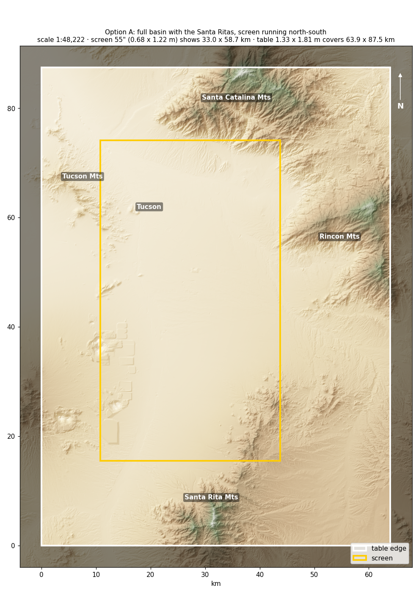
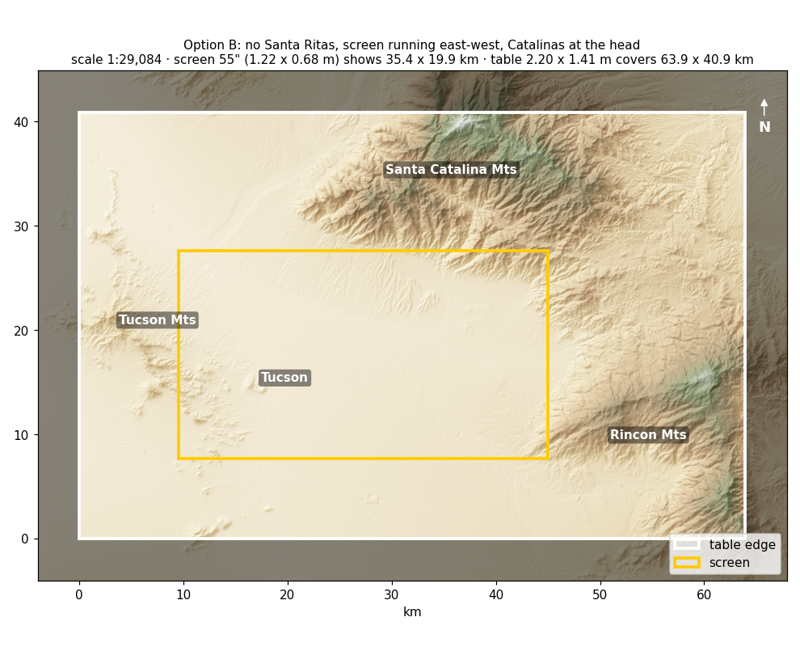

# Terrain Diorama for the Land-Planning Table

**Purpose:** The design of the 3D-printed terrain around the land-planning table's touchscreen is ready. What's left depends on facts and choices only the team can supply. Your answers set the model's scale, its geographic extent and the overall size of the table, and nothing can be printed until those are fixed.

**From:** Zachary Hansen. **To:** The Edge of the Desert team. **How your answers will be used:** to fix the terrain's dimensions and generate the printable tiles, the plywood cutting templates and the paint color targets.

## Context

The land-planning table is a flat touchscreen surrounded by a 3D-printed diorama of the mountains around Tucson. The screen shows the valley floor, where visitors place land-use pieces and see the effects. The printed terrain rises from the screen's edge into the surrounding ranges, and the map continues across the join so the screen and the landscape read as one surface. A printed lip hides the screen's bezel. The terrain is hand-painted from real aerial imagery, and it's built in sections so the table can be taken apart and moved. The open questions are how much of the basin to show, which way the screen lies, and the physical constraints of the room, the screen and the printers.

## How to answer

Please reply by **[date]**. It should take about 15 minutes. Write your answer in the box under each question, and put your initials next to it, since several people are answering one shared copy. Partial answers and "I don't know" are useful. If you're unsure, say so rather than skipping the question.

## Geographic extent

The two previews below show the main options with a 55" screen. The yellow box is the screen, the white box is the table, and the scale is set so the valley floor fills the screen.

| | Option A: with the Santa Ritas, screen north-south | Option B: without, screen east-west |
|---|---|---|
| Preview |  |  |
| Scale | 1:48,000 | 1:29,000 |
| Table | 1.33 × 1.81 m | 2.20 × 1.41 m |
| Screen shows | 33 × 59 km | 35 × 20 km |

Option B's scale is about 1.7 times larger, so the city and the Catalinas appear 1.7 times bigger in each direction, on a larger table.

### Should the model include the Santa Rita Mountains?

_Why this matters: the basin is about 76 km crest to crest north to south with the Santa Ritas and about 52 km east to west, so this one choice sets the model's scale and the table's shape._

>

### Should the model show the whole basin or a tighter area centred on the city?

_Why this matters: a smaller area makes the terrain and the city bigger and more detailed at the same table size._

>

### Should the screen's long side run north-south or east-west?

_Why this matters: a 16:9 screen is long and narrow, so it fits the full basin best running north-south, and a basin without the Santa Ritas best running east-west with the Catalinas at the head of the table._

>

### If the Santa Ritas are left out, what should form the table's south edge?

_Options: a narrow strip of printed valley, the wooden frame, or extending south into the Santa Rita foothills._

>

## Touchscreen

### Is a specific touchscreen already chosen or bought?

_Why this matters: the printed lip has to fit the exact outer size, bezel width and glass height of the real screen._

>

### If no screen is chosen yet, what size should it be: 43″, 55″ or 65″?

_Why this matters: the valley floor has to fill the screen, so the screen size sets the scale of the whole model._

>

## Room and placement

### How much floor space is available for the table?

>

### Will the table stand in the open or with one side against a wall?

_Why this matters: a range on the wall side only needs its valley-facing slope printed, which saves days of print time._

>

### What will the ambient lighting be in the installation space?

_Why this matters: the screen gives off its own light and the painted terrain only reflects light, so a dark room makes the terrain look dark next to the screen._

>

### Can we add spotlights aimed at the diorama?

>

## Fabrication

### Which 3D printers can we use?

_For example: our own, a makerspace, or the School of Architecture._

>

### What bed sizes do those printers have?

_Why this matters: the bed size sets the size of each tile, and so how many tiles there are to print, glue and paint._

>

## Schedule and budget

### When does the table need to be finished?

_Why this matters: a table of about 2 m × 1.5 m is roughly 35–40 tiles, or about three weeks of continuous printing on one printer._

>

### What is the budget for the screen, filament, paint, plywood and frame?

>

## Anything else?

Is there anything we didn't ask that we should know? For example, plans for the table's other features, how it gets transported, or reference models you've seen and liked.

>
